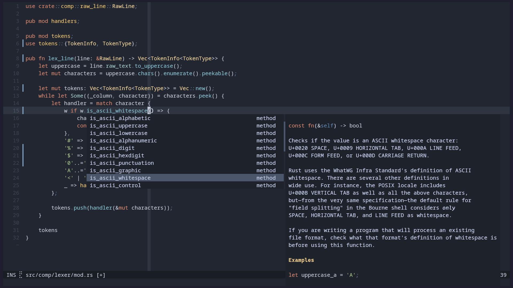

# 🌒 Nordic for [Helix](https://github.com/helix-editor/helix)

A Helix theme based on [AlexvZyl/Nordic.nvim](https://github.com/AlexvZyl/nordic.nvim).




## 📦 Installation

First copy [./nordic.toml](./nordic.toml) into `$HOME/.config/helix/themes/`.

Then run `theme nordic` in Helix or add `theme = "nordic"` to your config.toml.


## ⚙️ Configuration

You can customize the theme by inheriting it and applying your own modifications.

For example create a new **.toml** file in `$HOME/.config/helix/themes/` with the name of your theme and the following contents:

```toml
inherits = "nordic"

"ui.linenr.selected" = { fg = "green_base" } # make the current line number green

[palette]
black2 = "#BF616A" # make the background (and anything else that uses black2) red
```


## 🎨 Palette

Colors are defined in the palette section of [this file:](./nordic.toml)


